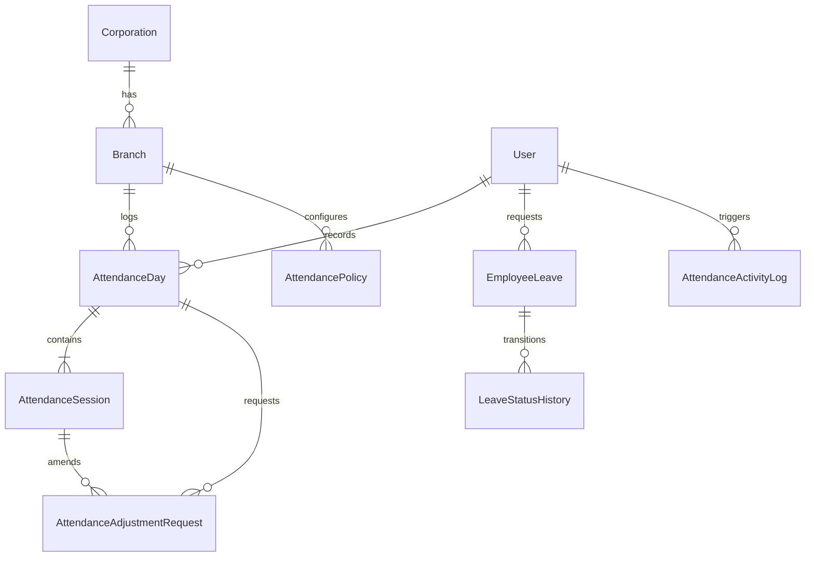
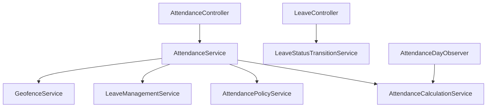
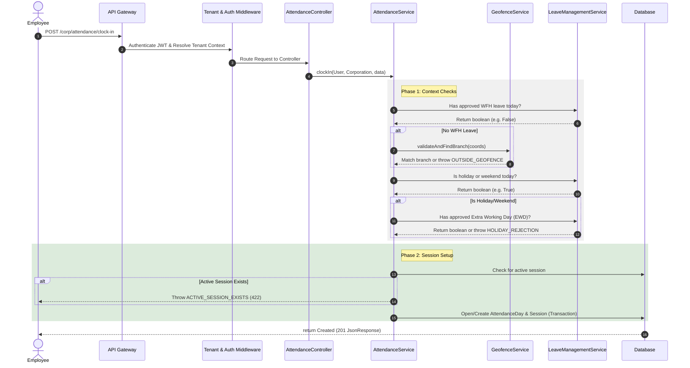
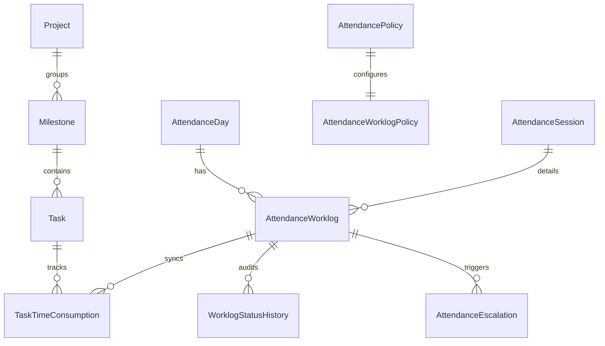

# Attendance Core Engine Architecture

This document describes the architectural design, database relationships, service layers, and validation lifecycles of the TimeNest **Attendance Core Engine (Phase 1)**.

---

## 1. Architectural Overview

The Attendance Core Engine is a highly optimized, transaction-safe service-oriented architecture designed to handle:
* **Real-time GPS validation** within corporate branch geofenced boundaries.
* **Automatic bypass rules** for approved Work From Home (WFH) and Extra Working Day (EWD) leaves.
* **Time-zone aware calculations** of daily work minutes, break minutes, late arrivals, and overtime.
* **Configuration-driven deduction penalty rules** mapping work minutes to compliance statuses (`Present`, `HalfDay`, `Absent`).
* **Fully auditable change tracking** via immutable activity logs and review processes.

---

## 2. Database Models & Schema Design

### Core Entities:
* **`AttendancePolicy`**: Defines work shifts, grace periods, strict mode boundaries, minimum hours for half/full day status, and overtime limits. Versioned to prevent historical data corruption when rules change.
* **`AttendanceDay`**: A daily aggregate record for a user. Summarizes total work, break, late, and overtime minutes, along with daily compliance status (`Present`, `HalfDay`, `Absent`).
* **`AttendanceSession`**: Individual clock-in/out segments within a day. Tracks GPS lat/lng, IP address, device ID, source medium (`Mobile`, `Web`, `AdminPanel`), and suspicious integrity markers.
* **`EmployeeLeave`**: Tracks absences, standard leaves (Casual, Sick), Work From Home (WFH), and Extra Working Days (EWD).
* **`LeaveStatusHistory`**: Logs chronological workflow state transitions of an `EmployeeLeave` application, recording who initiated the transition, old/new status, remarks, and metadata.
* **`CorporationHoliday`**: Standard corporate/branch holidays.
* **`AttendanceAdjustmentRequest`**: Manual corrections submitted by employees for past clock records, requiring review and approval by an authorized manager.
* **`AttendanceActivityLog`**: Immutable, append-only logs auditing adjustments, leaves, and session overrides.

---

## 3. Core Service Layer

To decouple business logic from the HTTP controllers, the engine is separated into distinct, domain-specific services:

### `GeofenceService`
- Implements coordinate checks using the Haversine formula to compute distance in meters.
- Restricts accuracy thresholds (`accuracy > 100.0` meters throws `POOR_GPS_ACCURACY`).
- Matches the client coordinates to the nearest active branch geofence boundary.

### `LeaveManagementService`
- Validates leave request constraints (e.g. preventing overlapping pending/approved leaves).
- Resolves if an employee is working under an approved **WFH** leave (bypassing geofencing) or **EWD** leave (allowing holiday/weekend clock-in).

### `LeaveStatusTransitionService`
- Manages the State Transition Machine for leave applications.
- Validates valid transitions from the current status (e.g., from `Pending` to `Approved`/`Rejected`/`Cancelled`).
- Enforces role-based permissions (requiring `leaves.approve` permission for management updates; allows self-cancellation for employees' own pending leaves).
- Automatically updates database properties (approved_by, approved_at, cancellation reasons) and logs transitions to `LeaveStatusHistory`.

### `AttendancePolicyService`
- Resolves the active policy context for a branch or corporation.
- Handles rule configuration, validation, and historical versioning.

### `AttendanceCalculationService`
- Computes raw clock durations and splits them into active work vs. break minutes.
- Calculates **Late Minutes** in strict mode (checking if clock-in is past shift start + grace buffer).
- Computes **Overtime Minutes** by checking total work minutes against daily thresholds.
- Evaluates configured **Deduction Penalty Slabs** to automatically downgrade compliance status (e.g., if worked minutes < 240 mins, downgrade status from `Present` to `HalfDay` or `Absent`).

### `AttendanceService`
- Orchestrates the daily clock-in/out state machine.
- Ensures transaction isolation to prevent race conditions during concurrent requests.
- Recalculates aggregates and updates records in atomic operations.

---

## 4. Lifecycle of a Clock-In Request

---

## 5. Recalculation Observers

To ensure database consistency and payroll-ready accuracy, Model Observers handle automated downstream calculations:
- **`AttendanceSessionObserver`**: Listens to changes in sessions. On session creation, update, or deletion, it triggers `RecalculateAttendanceDayJob` asynchronously or inline to compute work durations.
- **`EmployeeLeaveObserver`**: Triggers audit logging and initiates day recalculations when WFH/EWD requests are approved, rejected, or cancelled.
- **`AttendanceAdjustmentRequestObserver`**: Triggered when a manager approves an adjustment. Automatically initiates an absolute day aggregate recalculation.

---

## 6. Productivity & Worklog Compliance Architecture (Phase 2)

Phase 2 introduces the productivity tracking and compliance validation engine. It interfaces directly with projects, tasks, and attendance sessions, ensuring time logged matches actual attendance records.

### Mermaid Diagram

### Core Architecture Components:

1. **`AttendanceWorklogPolicy`**:
   - Separated from the core attendance policy.
   - Enforces rules: `strict_mode_enabled`, `allow_deferred_submission`, `require_project_mapping`, `require_task_mapping`, `require_justification_on_overflow`, `lock_after_days`.

2. **`AttendanceWorklog`**:
   - Stores time spent on specific tasks, milestones, and projects.
   - Transitions through `WorkflowStatusEnum` state machine (Draft -> Submitted -> Approved -> Locked, etc.).

3. **`TaskTimeConsumption`**:
   - Immutable records mapping active minutes spent on each task.
   - Enforces task overflow validation rules: if logged minutes exceed estimated minutes, requires a justification reason.

4. **`AttendanceEscalation`**:
   - Automated workflow escalation when worklogs are overdue (e.g. employee clocked out but did not submit worklogs within policy windows).
   - Escalations transition through `EscalationStatusEnum` (Pending -> Resolved -> Dismissed).

5. **`AttendanceCalculationService` Integration**:
   - Recalculation logic in strict mode updates daily attendance status to `Incomplete` if the employee failed to log sufficient worklog minutes matching their attendance session minutes.

